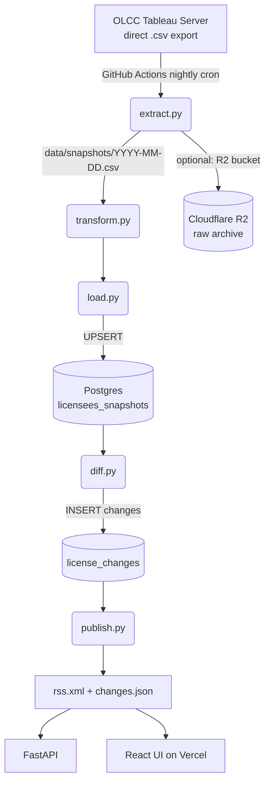

# Architecture

High-level view of the pipeline. Detailed plan in [PLAN.md](../PLAN.md);
verified source-extraction research in [TABLEAU_RESEARCH.md](TABLEAU_RESEARCH.md).

## Phase 1 dataflow

## Components

- **`etl/extract.py`** — fetches the OLCC CSV, writes to `data/snapshots/`,
  records provenance (URL, retrieved-at, sha256).
- **`etl/transform.py`** — normalizes columns, coerces types, validates
  against `vocabularies/`, preserves original row as `raw_row` JSONB.
- **`etl/load.py`** — UPSERTs into `licensees_snapshots` keyed on
  `(snapshot_date, license_number)`.
- **`etl/diff.py`** — compares today's snapshot to yesterday's, writes
  `NEW / REMOVED / FIELD_CHANGE` rows. Idempotent.
- **`etl/publish.py`** — regenerates public RSS + JSON from `license_changes`.
- **`api/` (Phase 1 end)** — FastAPI app serving `/api/changes/*` and
  `/api/licensees/*`.
- **`web/` (Phase 1 end)** — Vite + React + TypeScript UI.

## Data residency

- **Raw CSV snapshots** — committed to git (latest ~30 days loose) and,
  optionally, archived to Cloudflare R2 for longer retention.
- **Normalized records** — Postgres (Neon free tier in prod, local docker
  Postgres in dev).
- **Published artifacts** — `public/changes.json`, `public/rss.xml`
  committed back to the repo by the nightly Action.

## Observability

- GitHub Actions surfaces nightly-run success/failure.
- On failure, an issue is opened automatically (workflow step).
- Freshness SLO: **published data ≤ 26 hours stale** from source.
